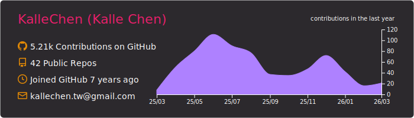
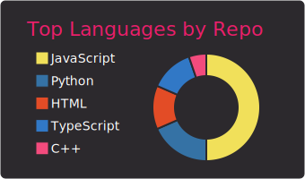
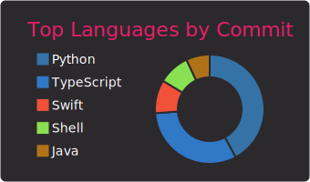
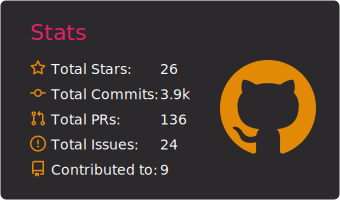
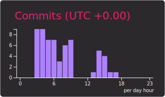

# Hi there 👋


```js
export default {
    name: 'Kalle',
    country: 'Taiwan',
    college: 'NCTU' || 'NYCU',
    techs: ['js', 'react', 'python', 'docker'],
    interests: ['coding', 'block chain', 'music', 'basketball']
}
```
 
  






