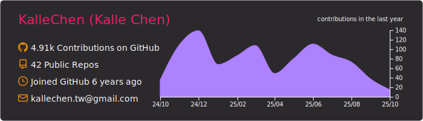
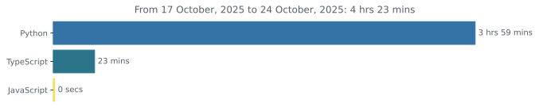
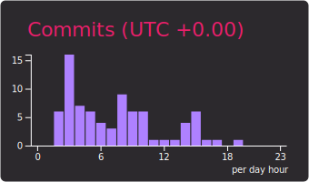

# Hi there 👋

[](https://wakatime.com/@e5887fe1-a295-427e-b6ee-236bad55b1fe)

```js
export default {
    name: 'Kalle',
    country: 'Taiwan',
    college: 'NCTU' || 'NYCU',
    major: 'computer science',
    techs: ['js', 'ts', 'react', 'python', 'docker', 'chaincode', 'hyperledger fabric'],
    interests: ['coding', 'blockchain', 'music', 'basketball']
}
```
 
  



