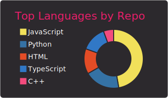
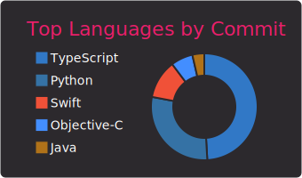

# Hi there 👋

[](https://wakatime.com/@e5887fe1-a295-427e-b6ee-236bad55b1fe)

[](https://twitter.com/kalle_chen)
[](https://discordapp.com/users/429537262079049738/)
[](https://t.me/kallechen)
[](https://medium.com/@kallechen)

```js
export default {
    name: 'Kalle',
    country: 'Taiwan',
    college: 'NCTU' || 'NYCU',
    major: 'computer science',
    techs: ['vim', 'js', 'ts', 'react', 'python', 'docker', 'smart contract', 'hyperledger fabric'],
    interests: ['coding', 'blockchain', 'music', 'basketball'],
    address: 'kallechen.eth'
}
```
 
  
 

<!-- 



 -->
